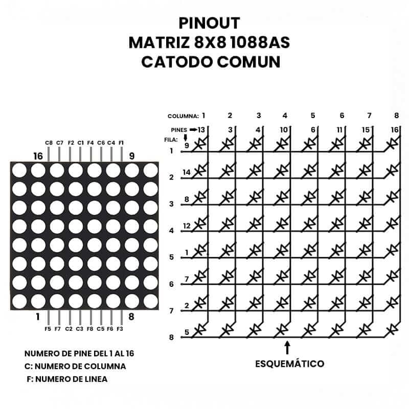

[](https://classroom.github.com/a/v98Y5mN9)
# Actividad 1
## Documentación del Proyecto
 
Nombre del estudiante: Samuel Arango Guerra
ID: 000482458

# Ejercicio 1 - Copiar datos a memoria

```assembly
.syntax unified
.global _start
.text

.equ DIR_BASE, 0x20000800 // Dirección base

.thumb_func

_start:
    bl  guardar_datos
    bx  lr

guardar_datos:
    ldr   r4, =DIR_BASE
    mov   r0, #50     // Inicializa el primer número a guardar
    mov   r1, #140    // Último número a guardar
loop_guardar:
    str   r0, [r4], #4 // Guarda el número en la memoria y avanza a la siguiente posición
    adds  r0, #10     // Incrementa el número en 10 para el siguiente ciclo
    cmp   r0, r1       // Compara si se ha alcanzado el último número
    ble   loop_guardar // Si no se ha alcanzado el último número, continuar guardando
    bx    lr           // Retorna
```

# Ejercicio 2 - Código ARM Cortex-M con comentarios y optimización

```assembly
.syntax unified          // Indica al ensamblador que use la sintaxis unificada ARM/Thumb.
.global _start           // Define el símbolo _start como global, que es el punto de entrada del código.

.text                    // Indica al ensamblador que las siguientes instrucciones están en la sección de código ejecutable.

.thumb_func              // Especifica que las siguientes funciones deben ensamblarse en modo Thumb.
_start:                  // Etiqueta que marca el inicio del código principal.
    bl  init             // Llama a la subrutina init.
    bl  cargar_memoria   // Llama a la subrutina cargar_memoria.
loop:                    // Etiqueta para el bucle infinito.
    bl  copiar_datos     // Llama a la subrutina copiar_datos.
    b   loop             // Salta incondicionalmente a la etiqueta loop, creando un bucle infinito.

init:                    // Inicio de la subrutina init.
    mov   r0, #0         // Coloca el valor 0 en el registro r0.
    mov   r1, #0         // Coloca el valor 0 en el registro r1.
    mov   r2, #0         // Coloca el valor 0 en el registro r2.
    bx    lr             // Retorna de la subrutina usando el registro de enlace lr.

cargar_memoria:          // Inicio de la subrutina cargar_memoria.
    ldr   r4, =#0x20000000 // Carga la dirección 0x20000000 en el registro r4.
    mov   r0, #1         // Coloca el valor 1 en el registro r0.
    mov   r1, #10        // Coloca el valor 10 en el registro r1, que servirá como contador.
loop_carga:              // Etiqueta para el bucle de carga de memoria.
    str   r0, [r4], #4   // Almacena el valor de r0 en la dirección apuntada por r4, luego incrementa r4 en 4.
    adds  r1, #-1        // Resta 1 al valor de r1 y actualiza los flags de condición.
    beq   fin_carga      // Si r1 es 0, salta a la etiqueta fin_carga.
    b     loop_carga     // Si r1 no es 0, salta de nuevo a loop_carga para continuar el bucle.
fin_carga:               // Etiqueta para finalizar la carga de memoria.
    bx    lr             // Retorna de la subrutina usando el registro de enlace lr.

copiar_datos:            // Inicio de la subrutina copiar_datos.
    ldr   r4, =#0x20000000 // Carga la dirección 0x20000000 en el registro r4.
loop_copia:              // Etiqueta para el bucle de copia de datos.
    ldr   r0, [r4]       // Carga el valor almacenado en la dirección apuntada por r4 en r0.
    cmp   r0, #0         // Compara el valor de r0 con 0.
    beq   fin_copia      // Si r0 es igual a 0, salta a la etiqueta fin_copia.
    str   r0, [r4, #0x100] // Almacena el valor de r0 en la dirección r4 + 0x100.
    add   r4, #4         // Incrementa r4 en 4 para apuntar al siguiente dato.
    b     loop_copia     // Salta de nuevo a loop_copia para continuar copiando datos.
fin_copia:               // Etiqueta para finalizar la copia de datos.
    bx    lr             // Retorna de la subrutina usando el registro de enlace lr.
```

### Optimización:
La subrutina `init` simplemente inicializa tres registros a 0. Si estos valores no son utilizados posteriormente, se podría eliminar `init` y esas instrucciones. Adicionalmente, el loop de copia se ejecuta indefinidamente, lo cual no es óptimo, ya que se estarían copiando los mismos datos una y otra vez. Por tal motivo, podría utilizarse la instrucción b . en lugar de b loop.

# Ejercicio 3 - Diseño Ícono


**Figura 1:** Kanji del sol

Se propone utilizar el kanji japonés del sol. A continuacion se presenta la secuencia de bits que representa la imagen para ser mostrada en el display. Los bits activos (1) representan LEDs encendidos:

``` Assembler
leds:
    .byte 0b00111100 // Representación de la primera fila de LEDs
    .byte 0b00100100 // Representación de la segunda fila de LEDs
    .byte 0b00100100 // Representación de la tercera fila de LEDs
    .byte 0b00111100 // Representación de la cuarta fila de LEDs
    .byte 0b00100100 // Representación de la quinta fila de LEDs
    .byte 0b00100100 // Representación de la sexta fila de LEDs
    .byte 0b00111100 // Representación de la séptima fila de LEDs
    .byte 0b00100100 // Representación de la octava fila de LEDs
```

# Ejercicio 4 - Análisis de Código en Lenguaje Ensamblador ARM

### Descripción del Código:

Este código ensamblador para ARM Cortex-M realiza la multiplicación de dos vectores y almacena el resultado en una nueva ubicación de memoria. A continuación se explica cada parte del código:

1. **Definición de Direcciones y Vectores:**
   - `v1`, `v2`, y `vRes` son direcciones en memoria donde se almacenan los datos.
   - `lista1` y `lista2` son los vectores de entrada, definidos como secuencias de números enteros de 16 bits (`.hword`), terminados en `0`.

2. **Punto de Entrada (`_start`):**
   - La función `_start` es el punto de entrada del código. Llama a las subrutinas `init`, `vector1`, `vector2`, y luego entra en un bucle infinito que llama repetidamente a `mult_vect`.

3. **Inicialización (`init`):**
   - `init` es una función vacía que simplemente retorna. Puede estar allí como una reserva para futuras inicializaciones que se necesiten.

4. **Carga de Vectores en Memoria (`vector1` y `vector2`):**
   - `vector1` y `vector2` cargan los valores de `lista1` y `lista2` en las direcciones de memoria `v1` y `v2`, respectivamente.
   - Estas subrutinas utilizan la función `loop_store` para iterar sobre los valores de los vectores y almacenarlos en la memoria hasta que encuentran un `0`, lo cual indica el final de los datos.

5. **Almacenamiento de Datos (`loop_store`):**
   - Esta función carga cada valor del vector en un registro (`r0`), verifica si es `0`, y si no lo es, lo almacena en la memoria. Luego, avanza a la siguiente posición de memoria.

6. **Multiplicación de Vectores (`mult_vect`):**
   - La función `mult_vect` multiplica los elementos correspondientes de `v1` y `v2`.
   - Dentro de `loop_mult`, se cargan elementos de `v1` y `v2`, se multiplican, y el resultado se almacena en la dirección `vRes`.
   - El bucle continúa hasta que encuentra un `0` en uno de los vectores, lo que indica el final de los datos.

# Ejercicio 5 - Identificación matriz LED 8x8


**Figura 2:** Disposición Eléctrica Matriz LED. Tomada de: [U Electronics - Matriz 8x8 1088AS LED](https://uelectronics.com/producto/matriz-8x8-1088as-led/)

La disposición eléctrica de los LEDS de la matriz referencia 1088AS se muestra en la Figura 2. Dicha información es verificada con el uso de un multímetro en el modo "Diodo".

# Ejercicio 6
## Parte 1
El código presentado a continuación permite encender un LED de la matriz, de acuerdo con los valores almacenados en los registros r0 (fila) y r1 (columna).

```assembly
.syntax unified
.global _start
.text

.equ PCC_PORTD, 0x40065130
.equ PCC_PORTB, 0x40065128
.equ PCC_PORTC, 0x4006512C
.equ PCC_CGC_OFFSET, 30 

.equ PORTD, 0x4004C000
.equ PORTB, 0x4004A000
.equ PORTC, 0x4004B000
.equ MUX_OFFSET, 8

.equ GPIOD, 0x400FF0C0
.equ GPIOB, 0x400FF040
.equ GPIOC, 0x400FF080
.equ GPIO_PDDR_OFFSET, 0x14
.equ GPIO_PDOR_OFFSET, 0x00
.equ GPIO_PDIR_OFFSET, 0x0A
.equ GPIO_PTOR_OFFSET, 0x0C

.thumb_func
_start:
    bl _init_clock
    bl _init_port
    bl _init_GPIO
    bl _init_LED_matrix
loop:   
    mov r0, #0
    mov r1, #0     
    bl _turn_on_matrix_LED
    b loop

_init_clock: // Inicializa el reloj 
    ldr r0, =PCC_PORTC
    mov r1, #1
    lsl r1, #PCC_CGC_OFFSET // Habilita el reloj para los periféricos asociados con el puerto C
    str r1, [r0]

    ldr r0, =PCC_PORTB // Habilita el reloj para los periféricos asociados con el puerto B
    str r1, [r0]
    
    bx lr

_init_port: // Inicializa los puertos
    ldr r0, =PORTC
    ldr r1, =PORTB
    mov r2, #1
    lsl r2, #MUX_OFFSET

    mov r3, #0x3C
    mov r4, #0x20
    _init_port_C:              
        str r2, [r0, r3]
        add r3, #-4
        cmp r3, r4
        bge _init_port_C

    mov r3, #0x44
    mov r4, #0x28
    _init_port_B:
        str r2, [r1, r3]
        add r3, #-4
        cmp r3, r4
        bge _init_port_B
    
    bx lr

_init_GPIO: // Inicializa los GPIO
    ldr r0, =GPIOC
    ldr r2, =GPIO_PDDR_OFFSET
    mov r1, #0xFF
    lsl r1, #8
    str r1, [r0, r2]

    ldr r0, =GPIOB
    mov r1, #0xFF
    lsl r1, #10
    str r1, [r0, r2]

    bx lr

_init_LED_matrix: // Inicializa la matriz LED
    ldr r0, =GPIOC
    ldr r1, =GPIOB
    ldr r2, =GPIO_PDOR_OFFSET

    mov r3, #0xFF
    lsl r3, #8
    str r3, [r0, r2]

    mov r3, #0x00
    lsl r3, #10
    str r3, [r1, r2]

    bx lr

_turn_on_matrix_LED: // Enciende un LED específico en la matriz LED
    ldr r2, =GPIOC
    ldr r3, =GPIOB
    ldr r4, =GPIO_PDOR_OFFSET

    mov r5, #1 // Fila 
    lsl r5, #8 // Desplazamiento de pines
    lsl r5, r0 // Desplazamiento de filas

    mov r6, #1 // Columna
    lsl r6, #10 // Desplazamiento de pines
    lsl r6, r1 // Desplazamiento de columnas

    // Activa la fila
    ldr r7, [r2, r4]
    mvn r5, r5
    and r7, r5
    str r7, [r2, r4]

    // Activa la columna
    ldr r8, [r3, r4]
    orr r8, r6
    str r8, [r3, r4]
    
    bx lr

_turn_off_matrix_LED: // Apaga un LED específico en la matriz LED
    ldr r2, =GPIOC
    ldr r3, =GPIOB
    ldr r4, =GPIO_PDOR_OFFSET

    mov r5, #1 // Fila 
    lsl r5, #8 // Desplazamiento de pines
    lsl r5, r0 // Desplazamiento de filas

    mov r6, #1 // Columna
    lsl r6, #10 // Desplazamiento de pines
    lsl r6, r1 // Desplazamiento de columnas

    // Desactiva la fila
    ldr r7, [r2, r4]
    orr r7, r5
    str r7, [r2, r4]

    // Desactiva la columna
    ldr r8, [r3, r4]
    mvn r6, r6
    and r8, r6
    str r8, [r3, r4]

    bx lr
```

### Explicación del Código:

1. **Definición de Direcciones y Offsets:**
   - Se definen las direcciones base para los puertos GPIO B, C, y D, y se configuran los offsets para la configuración de los pines y los registros de datos.

2. **Inicialización del Reloj (`_init_clock`):**
   - Esta función habilita los relojes para los puertos GPIO necesarios (B y C), asegurando que estén listos para ser utilizados.

3. **Inicialización de Puertos (`_init_port`):**
   - Configura los pines específicos en los puertos B y C para que funcionen como salidas para controlar los LEDs de la matriz.

4. **Inicialización de GPIO (`_init_GPIO`):**
   - Configura las direcciones de los pines en los puertos B y C como salidas digitales, preparando los GPIOs para controlar los LEDs.

5. **Inicialización de la Matriz LED (`_init_LED_matrix`):**
   - Establece todos los pines de la matriz en un estado inicial, apagando todos los LEDs.

6. **Encender un LED en la Matriz (`_turn_on_matrix_LED`):**
   - Esta función activa una fila y una columna específicas en la matriz para encender un LED en la posición deseada.

7. **Apagar un LED en la Matriz (`_turn_off_matrix_LED`):**
   - Esta función desactiva una fila y una columna específicas, apagando el LED correspondiente.

### Uso:
- **Ciclo Infinito:** El código entra en un bucle infinito, encendiendo continuamente un LED específico según los valores de `r0` (fila) y `r1` (columna).
- **Personalización:** Modifica `r0` y `r1` en el ciclo principal para encender diferentes LEDs en la matriz.

## Parte 2
El código presentado a continuación permite encender todos los LEDs de la matriz de forma secuencial.

``` Assembler
.syntax unified
.global _start
.text

.equ PCC_PORTD, 0x40065130
.equ PCC_PORTB, 0x40065128
.equ PCC_PORTC, 0x4006512C
.equ PCC_CGC_OFFSET, 30 

.equ PORTD, 0x4004C000
.equ PORTB, 0x4004A000
.equ PORTC, 0x4004B000
.equ MUX_OFFSET, 8

.equ GPIOD, 0x400FF0C0
.equ GPIOB, 0x400FF040
.equ GPIOC, 0x400FF080
.equ GPIO_PDDR_OFFSET, 0x14
.equ GPIO_PDOR_OFFSET, 0x00
.equ GPIO_PDIR_OFFSET, 0x0A
.equ GPIO_PTOR_OFFSET, 0x0C

.equ CLOCK_COUNT, 1000000

.thumb_func
_start:
    bl _init_clock
    bl _init_port
    bl _init_GPIO
    bl _init_LED_matrix
loop:        
    // Note: Rows and Columns are counted starting from 0 
    // Note: r0 contains Row, while r1 contains Column

    LED_MATRIX_LOOP:
        mov r0, #2
        ROWS_LOOP:
            cmp r0, #8
            bge END_LED_MATRIX_LOOP
            mov r1, #0
            COLUMNS_LOOP:
                cmp r1, #8
                bge END_COLUMNS_LOOP
                bl _turn_on_matrix_LED
                bl _wait
                bl _turn_off_matrix_LED
                add r1, #1
                b COLUMNS_LOOP
            END_COLUMNS_LOOP:
            add r0, #1
            b ROWS_LOOP
    END_LED_MATRIX_LOOP:
    
    b loop

// ---------------------------------------------------------------------------------------------
// FUNCTIONS

_init_clock: // Inicializa el reloj
    ldr r0, =PCC_PORTC
    mov r1, #1
    lsl r1, #PCC_CGC_OFFSET // Habilita el reloj para los periféricos asociados con el puerto D
    str r1, [r0]

    ldr r0, =PCC_PORTB // Habilita el reloj para los periféricos asociados con el puerto B
    str r1, [r0]
    
    bx lr

_init_port: // Inicializa los puertos
    ldr r0, =PORTC
    ldr r1, =PORTB
    mov r2, #1
    lsl r2, #MUX_OFFSET

    mov r3, #0x3C
    mov r4, #0x20
    _init_port_C:              
        str r2, [r0, r3]
        add r3, #-4
        cmp r3, r4
        bge _init_port_C

    mov r3, #0x44
    mov r4, #0x28
    _init_port_B:
        str r2, [r1, r3]
        add r3, #-4
        cmp r3, r4
        bge _init_port_B
    
    bx lr

_init_GPIO: // Inicializa los GPIO
    ldr r0, =GPIOC
    ldr r2, =GPIO_PDDR_OFFSET
    mov r1, #0xFF
    lsl r1, #8
    str r1, [r0, r2]

    ldr r0, =GPIOB
    mov r1, #0xFF
    lsl r1, #10
    str r1, [r0, r2]

    bx lr

_init_LED_matrix: // Inicializa la matriz LED
    ldr r0, =GPIOC
    ldr r1, =GPIOB
    ldr r2, =GPIO_PDOR_OFFSET

    mov r3, #0xFF
    lsl r3, #8
    str r3, [r0, r2]

    mov r3, #0x00
    lsl r3, #10
    str r3, [r1, r2]

    bx lr

_turn_on_matrix_LED: // Enciende un LED específico en la matriz LED
    ldr r2, =GPIOC
    ldr r3, =GPIOB
    ldr r4, =GPIO_PDOR_OFFSET

    mov r5, #1 // Fila 
    lsl r5, #8 // Desplazamiento de pines
    lsl r5, r0 // Desplazamiento de filas

    mov r6, #1 // Columna
    lsl r6, #10 // Desplazamiento de pines
    lsl r6, r1 // Desplazamiento de columnas

    // Activa la fila
    ldr r7, [r2, r4]
    mvn r5, r5
    and r7, r5
    str r7, [r2, r4]

    // Activa la columna
    ldr r8, [r3, r4]
    orr r8, r6
    str r8, [r3, r4]
    
    bx lr

_turn_off_matrix_LED: // Apaga un LED específico en la matriz LED
    ldr r2, =GPIOC
    ldr r3, =GPIOB
    ldr r4, =GPIO_PDOR_OFFSET

    mov r5, #1 // Fila 
    lsl r5, #8 // Desplazamiento de pines
    lsl r5, r0 // Desplazamiento de filas

    mov r6, #1 // Columna
    lsl r6, #10 // Desplazamiento de pines
    lsl r6, r1 // Desplazamiento de columnas

    // Desactiva la fila
    ldr r7, [r2, r4]
    orr r7, r5
    str r7, [r2, r4]

    // Desactiva la columna
    ldr r8, [r3, r4]
    mvn r6, r6
    and r8, r6
    str r8, [r3, r4]

    bx lr

_wait: // Introduce un retraso entre el encendido de cada LED
    ldr r2, =CLOCK_COUNT
    LOOP:
        adds r2, #-1
        beq END
        b LOOP
    END:
    bx lr
```


### Explicación del Código:

1. **Inicialización del Reloj (`_init_clock`):**
   - Habilita los relojes para los puertos GPIO necesarios, asegurando que los periféricos estén activos y listos para su uso.

2. **Inicialización de Puertos (`_init_port`):**
   - Configura los pines de los puertos B y C para funcionar como salidas digitales, permitiendo el control de las filas y columnas de la matriz LED.

3. **Inicialización de GPIO (`_init_GPIO`):**
   - Establece las direcciones de los pines en los puertos B y C como salidas digitales, preparándolos para la operación con la matriz LED.

4. **Inicialización de la Matriz LED (`_init_LED_matrix`):**
   - Apaga todos los LEDs de la matriz inicialmente, asegurando que la matriz comience en un estado conocido.

5. **Bucle Principal (`loop`):**
   - El bucle principal del programa recorre todas las posiciones de la matriz, encendiendo y apagando cada LED de manera secuencial. 
   - `r0` se utiliza para seleccionar la fila y `r1` para la columna. Después de encender y apagar un LED, el programa avanza a la siguiente columna y fila.

6. **Encender y Apagar LEDs (`_turn_on_matrix_LED`, `_turn_off_matrix_LED`):**
   - Estas funciones manejan el encendido y apagado de los LEDs específicos en la matriz, manipulando los registros GPIO correspondientes para activar las filas y columnas deseadas.

7. **Función de Retardo (`_wait`):**
   - Introduce un retraso después de encender cada LED para que el encendido secuencial sea visible. Esto se logra con un bucle que cuenta hacia atrás desde un valor alto.

# Actividad 2
El código corregido y comentado se presenta a continuacion:
``` Assembly
mov r2, #0                 // Resetea el contador de tiempo a 0.
str r2, [r4, entrada_tiempo_M0] // Almacena el valor reseteado en entrada_tiempo_M0.
pop {lr}                   // Restaura el valor original del registro de enlace (lr) desde la pila.
bx lr                      // Retorna de la subrutina al llamador.

.thumb_func                // Indica que la siguiente función (estado_amarillo) está en modo Thumb.

estado_amarillo:
    ldr r4, =Base_maquina_0   // Carga la dirección base de la estructura de la máquina de estados en r4.
    ldr r0, [r4, #entrada_tiempo_M0] // Carga el tiempo transcurrido en el estado actual en r0.
    ldr r5, =TIEMPO_AMARILLO   // Carga el valor de TIEMPO_AMARILLO en r5, que representa el tiempo máximo para el estado amarillo.
    cmp r0, r5                 // Compara el tiempo transcurrido (r0) con el tiempo máximo permitido (r5).
    blt fin_estado             // Si el tiempo transcurrido es menor que el tiempo máximo, salta a fin_estado.

    // Configurar salida
    ldr r0, =GPIOB_PCOR        // Carga la dirección del registro de borrado de salida (PCOR) de GPIOB en r0.
    mov r1, #(1 << LED_AMARILLO) // Prepara el valor para apagar el LED amarillo en r1.
    str r1, [r0]               // Escribe el valor en PCOR para apagar el LED amarillo.

    ldr r0, =GPIOB_PCOR        // Carga la dirección del registro de borrado de salida (PCOR) de GPIOB en r0.
    mov r1, #(1 << LED_ROJO)   // Prepara el valor para apagar el LED rojo en r1.
    str r1, [r0]               // Escribe el valor en PCOR para apagar el LED rojo.
    mov r1, #(1 << LED_VERDE)  // Prepara el valor para apagar el LED verde en r1.
    str r1, [r0]               // Escribe el valor en PCOR para apagar el LED verde.

    // Cambiar al siguiente estado
    mov r1, #ROJO              // Carga el valor correspondiente al estado ROJO en r1.
    str r1, [r4, #var_estado_M0] // Almacena el nuevo estado en la variable var_estado_M0.
    mov r2, #0                 // Resetea el contador de tiempo a 0.
    str r2, [r4, entrada_tiempo_M0] // Almacena el valor reseteado en entrada_tiempo_M0.
    pop {lr}                   // Restaura el valor original del registro de enlace (lr) desde la pila.
    bx lr                      // Retorna de la subrutina al llamador.

fin_estado:                   // Etiqueta fin_estado para saltar en caso de que el tiempo no haya expirado.
    pop {lr}                   // Restaura el valor original del registro de enlace (lr) desde la pila.
    bx lr                      // Retorna de la subrutina al llamador.
```
``` Assembly
#include "definitions.h"    // Incluye las definiciones necesarias, como registros y valores constantes.

.syntax unified             // Establece la sintaxis unificada de ARM para soportar tanto instrucciones ARM como Thumb.
.global estado_semaforo     // Define la etiqueta estado_semaforo como global, permitiendo que sea visible para el vinculador.

.text                       // Inicia la sección de código (instrucciones) en la memoria.

.align 2                    // Alinea la tabla de direcciones a 4 bytes (2^2 = 4), asegurando que las direcciones de las etiquetas estén alineadas correctamente.
// Lista de direcciones de los estados
dir_tabla_estados:
  .long estado_rojo           // Dirección de la subrutina estado_rojo.
  .long estado_rojo_amarillo  // Dirección de la subrutina estado_rojo_amarillo.
  .long estado_verde          // Dirección de la subrutina estado_verde.
  .long estado_amarillo       // Dirección de la subrutina estado_amarillo.

.thumb_func                   // Indica que la siguiente función (estado_semaforo) está en modo Thumb.

estado_semaforo:
    push {lr}                 // Guarda el registro de enlace (lr) en la pila para preservar el valor de retorno.
    ldr r4, =Base_maquina_0   // Carga la dirección base de la estructura de la máquina de estados en el registro r4.
    ldr r0, [r4, #var_estado_M0] // Carga el valor actual del estado de la máquina de estados en el registro r0.
    lsl r0, #2                // Desplaza a la izquierda el valor en r0 por 2 bits, multiplicándolo por 4 (tamaño de palabra).
    ldr r4, =dir_tabla_estados // Carga la dirección de la tabla de estados en el registro r4.
    ldr r1, [r4, r0]          // Carga la dirección de la subrutina correspondiente al estado actual en r1.
    bx r1                     // Salta a la dirección almacenada en r1 para ejecutar la subrutina del estado.

.thumb_func                   // Indica que la siguiente función (estado_rojo) está en modo Thumb.

estado_rojo:
    ldr r4, =Base_maquina_0   // Carga la dirección base de la estructura de la máquina de estados en r4.
    ldr r0, [r4, #entrada_tiempo_M0] // Carga el tiempo transcurrido en el estado actual en r0.
    ldr r5, =TIEMPO_ROJO       // Carga el valor de TIEMPO_ROJO en r5, que representa el tiempo máximo para el estado rojo.
    cmp r0, r5                 // Compara el tiempo transcurrido (r0) con el tiempo máximo permitido (r5).
    blt fin_estado             // Si el tiempo transcurrido es menor que el tiempo máximo, salta a fin_estado.

    // Salidas
    ldr r0, =GPIOB_PCOR        // Carga la dirección del registro de borrado de salida (PCOR) de GPIOB en r0.
    mov r1, #(1 << LED_ROJO)   // Prepara el valor para apagar el LED rojo en r1.
    orr r1, #(1 << LED_AMARILLO) // Combina el valor para apagar también el LED amarillo.
    str r1, [r0]               // Escribe el valor en PCOR para apagar el LED rojo y amarillo.
    mov r1, #0                 // Prepara un valor de 0 en r1.
    str r1, [r0]               // Escribe 0 en PCOR para asegurarse de que no haya más LEDs encendidos.

    ldr r0, =GPIOB_PSOR        // Carga la dirección del registro de establecimiento de salida (PSOR) de GPIOB en r0.
    mov r1, #(1 << LED_VERDE)  // Prepara el valor para encender el LED verde en r1.
    str r1, [r0]               // Escribe el valor en PSOR para encender el LED verde.
    mov r1, #0                 // Prepara un valor de 0 en r1.
    str r1, [r0]               // Escribe 0 en PSOR para asegurarse de que no haya más LEDs afectados.

    // Cambiar al siguiente estado
    mov r1, #ROJO_AMARILLO     // Carga el valor correspondiente al estado ROJO_AMARILLO en r1.
    str r1, [r4, #var_estado_M0] // Almacena el nuevo estado en la variable var_estado_M0.
    mov r2, #0                 // Resetea el contador de tiempo a 0.
    str r2, [r4, #entrada_tiempo_M0] // Almacena el valor reseteado en entrada_tiempo_M0.
    pop {lr}                   // Restaura el valor original del registro de enlace (lr) desde la pila.
    bx lr                      // Retorna de la subrutina al llamador.

.thumb_func                   // Indica que la siguiente función (estado_rojo_amarillo) está en modo Thumb.

estado_rojo_amarillo:
    ldr r4, =Base_maquina_0   // Carga la dirección base de la estructura de la máquina de estados en r4.
    ldr r0, [r4, #entrada_tiempo_M0] // Carga el tiempo transcurrido en el estado actual en r0.
    ldr r5, =TIEMPO_ROJO_AMARILLO // Carga el valor de TIEMPO_ROJO_AMARILLO en r5, que representa el tiempo máximo para el estado rojo-amarillo.
    cmp r0, r5                 // Compara el tiempo transcurrido (r0) con el tiempo máximo permitido (r5).
    blt fin_estado             // Si el tiempo transcurrido es menor que el tiempo máximo, salta a fin_estado.

    // Configura la salida
    ldr r0, =GPIOB_PCOR        // Carga la dirección del registro de borrado de salida (PCOR) de GPIOB en r0.
    mov r1, #(1 << LED_VERDE)  // Prepara el valor para apagar el LED verde en r1.
    str r1, [r0]               // Escribe el valor en PCOR para apagar el LED verde.
    mov r1, #0                 // Prepara un valor de 0 en r1.
    str r1, [r0]               // Escribe 0 en PCOR para asegurarse de que no haya más LEDs encendidos.

    ldr r0, =GPIOB_PSOR        // Carga la dirección del registro de establecimiento de salida (PSOR) de GPIOB en r0.
    mov r1, #(1 << LED_ROJO) | (1 << LED_AMARILLO) // Prepara el valor para encender los LEDs rojo y amarillo en r1.
    str r1, [r0]               // Escribe el valor en PSOR para encender los LEDs rojo y amarillo.
    mov r1, #0                 // Prepara un valor de 0 en r1.
    str r1, [r0]               // Escribe 0 en PSOR para asegurarse de que no haya más LEDs afectados.

    // Cambiar al siguiente estado
    mov r1, #VERDE             // Carga el valor correspondiente al estado VERDE en r1.
    str r1, [r4, #var_estado_M0] // Almacena el nuevo estado en la variable var_estado_M0.
    mov r2, #0                 // Resetea el contador de tiempo a 0.
    str r2, [r4, #entrada_tiempo_M0] // Almacena el valor reseteado en entrada_tiempo_M0.
    pop {lr}                   // Restaura el valor original del registro de enlace (lr) desde la pila.
    bx lr                      // Retorna de la subrutina al llamador.

.thumb_func                   // Indica que la siguiente función (estado_verde) está en modo Thumb.

estado_verde:
    ldr r4, =Base_maquina_0   // Carga la dirección base de la estructura de la máquina de estados en r4.
    ldr r0, [r4, #entrada_tiempo_M0] // Carga el tiempo transcurrido en el estado actual en r0.
    ldr r5, =TIEMPO_VERDE      // Carga el valor de TIEMPO_VERDE en r5, que representa el tiempo máximo para el estado verde.
    cmp r0, r5                 // Compara el tiempo transcurrido (r0) con el tiempo máximo permitido (r5).
    blt fin_estado             // Si el tiempo transcurrido es menor que el tiempo máximo, salta a fin_estado.

    // Configura salida
    ldr r0, =GPIOB_PCOR        // Carga la dirección del registro de borrado de salida (PCOR) de GPIOB en r0.
    mov r1, #(1 << LED_AMARILLO) // Prepara el valor para apagar el LED amarillo en r1.
    str r1, [r0]               // Escribe el valor en PCOR para apagar el LED amarillo.
    mov r1, #0                 // Prepara un valor de 0 en r1.
    str r1, [r0]               // Escribe 0 en PCOR para asegurarse de que no haya más LEDs encendidos.

    ldr r0, =GPIOB_PSOR        // Carga la dirección del registro de establecimiento de salida (PSOR) de GPIOB en r0.
    mov r1, #(1 << LED_VERDE) | (1 << LED_ROJO) // Prepara el valor para encender los LEDs verde y rojo en r1.
    str r1, [r0]               // Escribe el valor en PSOR para encender los LEDs verde y rojo.
    mov r1, #0                 // Prepara un valor de 0 en r1.
    str r1, [r0]               // Escribe 0 en PSOR para asegurarse de que no haya más LEDs afectados.

    // Cambiar al siguiente estado
    mov r1, #AMARILLO          // Carga el valor correspondiente al estado AMARILLO en r1.
    str r1, [r4, #var_estado_M0] // Almacena el nuevo estado en la variable var_estado_M0.
    mov r2, #0                 // Resetea el contador de tiempo a 0.
    str r2, [r4, #entrada_tiempo_M0] // Almacena el valor reseteado en entrada_tiempo_M0.
    pop {lr}                   // Restaura el valor original del registro de enlace (lr) desde la pila.
    bx lr                      // Retorna de la subrutina al llamador.

.thumb_func                   // Indica que la siguiente función (estado_amarillo) está en modo Thumb.

estado_amarillo:
    ldr r4, =Base_maquina_0   // Carga la dirección base de la estructura de la máquina de estados en r4.
    ldr r0, [r4, #entrada_tiempo_M0] // Carga el tiempo transcurrido en el estado actual en r0.
    ldr r5, =TIEMPO_AMARILLO   // Carga el valor de TIEMPO_AMARILLO en r5, que representa el tiempo máximo para el estado amarillo.
    cmp r0, r5                 // Compara el tiempo transcurrido (r0) con el tiempo máximo permitido (r5).
    blt fin_estado             // Si el tiempo transcurrido es menor que el tiempo máximo, salta a fin_estado.

    // Configurar salida
    ldr r0, =GPIOB_PCOR        // Carga la dirección del registro de borrado de salida (PCOR) de GPIOB en r0.
    mov r1, #(1 << LED_ROJO)   // Prepara el valor para apagar el LED rojo en r1.
    str r1, [r0]               // Escribe el valor en PCOR para apagar el LED rojo.
    mov r1, #0                 // Prepara un valor de 0 en r1.
    str r1, [r0]               // Escribe 0 en PCOR para asegurarse de que no haya más LEDs encendidos.

    ldr r0, =GPIOB_PSOR        // Carga la dirección del registro de establecimiento de salida (PSOR) de GPIOB en r0.
    mov r1, #(1 << LED_AMARILLO) | (1 << LED_VERDE) // Prepara el valor para encender los LEDs amarillo y verde en r1.
    str r1, [r0]               // Escribe el valor en PSOR para encender los LEDs amarillo y verde.
    mov r1, #0                 // Prepara un valor de 0 en r1.
    str r1, [r0]               // Escribe 0 en PSOR para asegurarse de que no haya más LEDs afectados.

    // Cambiar al siguiente estado
    mov r1, #ROJO              // Carga el valor correspondiente al estado ROJO en r1.
    str r1, [r4, #var_estado_M0] // Almacena el nuevo estado en la variable var_estado_M0.
    mov r2, #0                 // Resetea el contador de tiempo a 0.
    str r2, [r4, #entrada_tiempo_M0] // Almacena el valor reseteado en entrada_tiempo_M0.
    pop {lr}                   // Restaura el valor original del registro de enlace (lr) desde la pila.
    bx lr                      // Retorna de la subrutina al llamador.

fin_estado:                   // Etiqueta fin_estado para saltar en caso de que el tiempo no haya expirado.
    pop {lr}                   // Restaura el valor original del registro de enlace (lr) desde la pila.
    bx lr                      // Retorna de la subrutina al llamador.
```
``` Assembly
.syntax unified                 // Establece la sintaxis unificada de ARM para soportar tanto instrucciones ARM como Thumb.
.global SysTick_Handler         // Define la etiqueta SysTick_Handler como global, permitiendo que sea visible para el vinculador.
.text                           // Inicia la sección de código (instrucciones) en la memoria.

.equ Base_maquina_0, 0x20001000 // Define la dirección base de la estructura de la máquina de estados en la RAM (0x20001000).
.equ entrada_tiempo_M0, 4       // Define un desplazamiento (offset) de 4 bytes desde la base para la variable entrada_tiempo_M0.

.thumb_func                     // Indica que la siguiente función (SysTick_Handler) está en modo Thumb.

SysTick_Handler:                // Inicio del manejador de la interrupción SysTick.
    push {r4}                   // Guarda el valor del registro r4 en la pila para preservar su valor durante la interrupción.
    ldr r4, =Base_maquina_0     // Carga la dirección base de la estructura de la máquina de estados en el registro r4.
    ldr r0, [r4, #entrada_tiempo_M0] // Lee el valor actual del tiempo transcurrido desde la dirección [Base_maquina_0 + entrada_tiempo_M0].
    add r0, r0, #1              // Incrementa el valor de r0 en 1, representando un incremento de 1 ms.
    str r0, [r4, #entrada_tiempo_M0] // Almacena el valor incrementado de nuevo en la variable entrada_tiempo_M0.
    pop {r4}                    // Restaura el valor original del registro r4 desde la pila.
    bx lr                       // Retorna de la interrupción, saltando a la dirección almacenada en el registro de enlace (lr).
```
``` Assembly
.text

// Direcciones de los registros SysTick
.equ SYSTICK_BASE, 0xE000E010        // Base del SysTick: Punto de partida para acceder a los registros del temporizador SysTick.
.equ SYST_CSR, (SYSTICK_BASE + 0x0)  // SysTick Control and Status Register: Registro de control y estado para gestionar el temporizador SysTick.
.equ SYST_RVR, (SYSTICK_BASE + 0x4)  // SysTick Reload Value Register: Registro que define el valor de recarga del contador.
.equ SYST_CVR, (SYSTICK_BASE + 0x8)  // SysTick Current Value Register: Registro que contiene el valor actual del contador.

.equ SYSTICK_ENABLE, 0x1             // Bit para habilitar el SysTick: Activa el temporizador SysTick.
.equ SYSTICK_TICKINT, 0x2            // Bit para habilitar la interrupción del SysTick: Permite la generación de una interrupción cuando el contador llega a 0.
.equ SYSTICK_CLKSOURCE, 0x4          // Bit para seleccionar el reloj del procesador: Selecciona el reloj principal del procesador como fuente de reloj para SysTick.

.equ SYSTICK_RELOAD_1MS, 48000 - 1   // Valor para recargar el SysTick cada 1 ms: Establece el valor de recarga para generar una interrupción cada milisegundo, suponiendo una frecuencia de 48 MHz.

.equ Base_maquina_0, 0x20001000      // Dirección base compartida: Dirección base en la RAM para la estructura de la máquina de estados.
.equ var_estado_M0, 0                // Offset para la variable de estado: Desplazamiento en la estructura para acceder a la variable que almacena el estado actual.
.equ entrada_tiempo_M0, 4            // Offset para la entrada de tiempo transcurrido: Desplazamiento en la estructura para acceder a la variable que almacena el tiempo transcurrido.


// Direcciones de los registros GPIO (Ejemplo para Kinetis K64)
.equ GPIOB_PDDR, 0x400FF054          // Registro de dirección de datos del puerto B: Controla la dirección de los pines del puerto B (entrada/salida).
.equ GPIOB_PDOR, 0x400FF040          // Registro de salida de datos del puerto B: Contiene los valores que se enviarán a los pines del puerto B.
.equ GPIOB_PTOR, 0x400FF04C          // Registro de alternancia de datos del puerto B: Permite alternar el estado de los pines del puerto B.
.equ GPIOB_PSOR, 0x400FF044          // Registro de establecer bits de salida en puerto B: Permite establecer en alto (1) los pines específicos del puerto B.
.equ GPIOB_PCOR, 0x400FF048          // Registro de limpiar bits de salida en puerto B: Permite limpiar (poner en bajo) los pines específicos del puerto B.


// Definición de los registros y valores
.equ PCC_BASE, 0x40065000              // Base del PCC (Peripheral Clock Control): Punto de partida para acceder a los registros del controlador de reloj de los periféricos.
.equ PCC_PORTB, (PCC_BASE + 0x128)     // Offset para el PCC del puerto B: Registro específico para controlar el reloj del puerto B.
.equ PORTB_BASE, 0x4004A000            // Base del PORTB: Punto de partida para acceder a los registros del puerto B.
.equ PORTB_PCR12, (PORTB_BASE + 0x30)  // PCR para PTB12: Registro de control de pin para el pin 12 del puerto B.
.equ PORTB_PCR13, (PORTB_BASE + 0x34)  // PCR para PTB13: Registro de control de pin para el pin 13 del puerto B.
.equ PORTB_PCR14, (PORTB_BASE + 0x38)  // PCR para PTB14: Registro de control de pin para el pin 14 del puerto B.
.equ MUX_GPIO, 0x1                     // Configuración Mux para GPIO (Alternativa 1): Configura el pin para funcionar como GPIO (Entrada/Salida general).
.equ PCC_PORTB_CGC, (1 << 30)          // Bit para habilitar el reloj del puerto B: Activa el reloj para el puerto B en el registro PCC_PORTB.


// Bits correspondientes a los LEDs
.equ LED_ROJO, 12                    // LED Rojo conectado a PTB12: El LED rojo está conectado al pin 12 del puerto B.
.equ LED_AMARILLO, 13                // LED Amarillo conectado a PTB13: El LED amarillo está conectado al pin 13 del puerto B.
.equ LED_VERDE, 14                   // LED Verde conectado a PTB14: El LED verde está conectado al pin 14 del puerto B.


// Definición de los tiempos en ciclos de reloj (ajustar según la frecuencia del microcontrolador)
.equ TIEMPO_ROJO, 5000               // Tiempo en ciclos de reloj para el estado ROJO.
.equ TIEMPO_ROJO_AMARILLO, 3000      // Tiempo en ciclos de reloj para el estado ROJO_AMARILLO.
.equ TIEMPO_VERDE, 5000              // Tiempo en ciclos de reloj para el estado VERDE.
.equ TIEMPO_AMARILLO, 2000           // Tiempo en ciclos de reloj para el estado AMARILLO.


// Definición de los estados
.equ ROJO, 0                         // Estado ROJO: Código de estado para el semáforo en ROJO.
.equ ROJO_AMARILLO, 1                // Estado ROJO_AMARILLO: Código de estado para el semáforo en ROJO_AMARILLO.
.equ VERDE, 2                        // Estado VERDE: Código de estado para el semáforo en VERDE.
.equ AMARILLO, 3                     // Estado AMARILLO: Código de estado para el semáforo en AMARILLO.

```